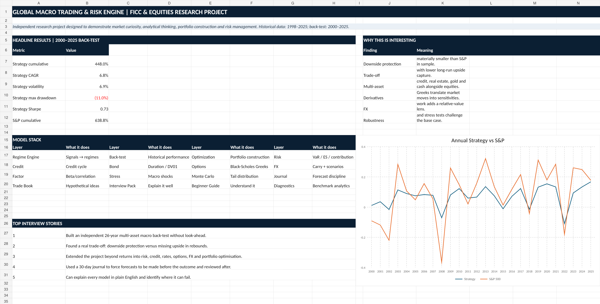
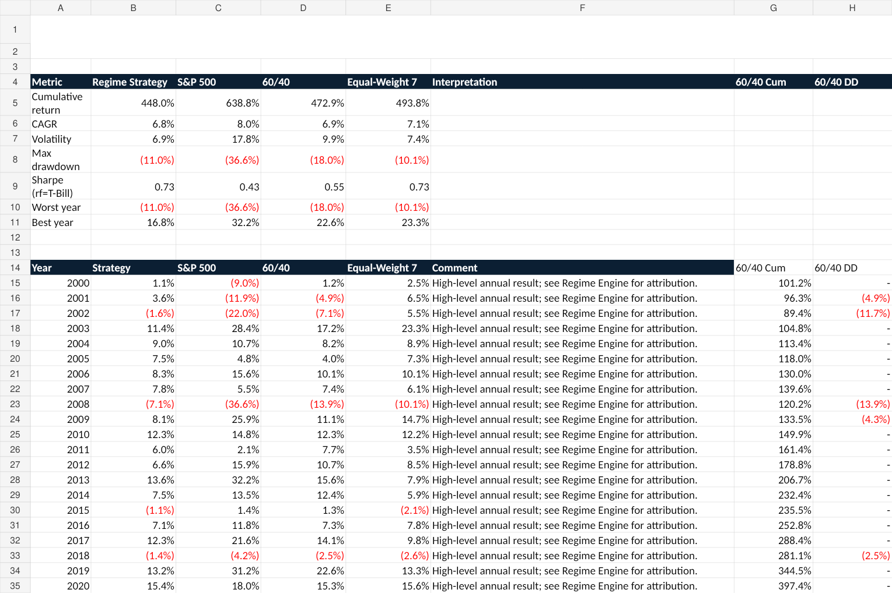
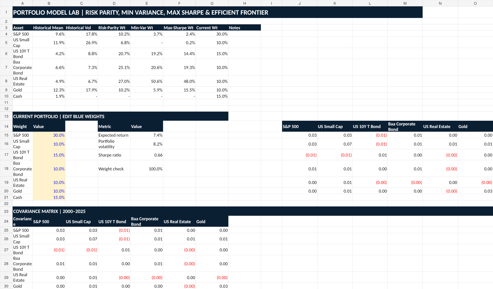
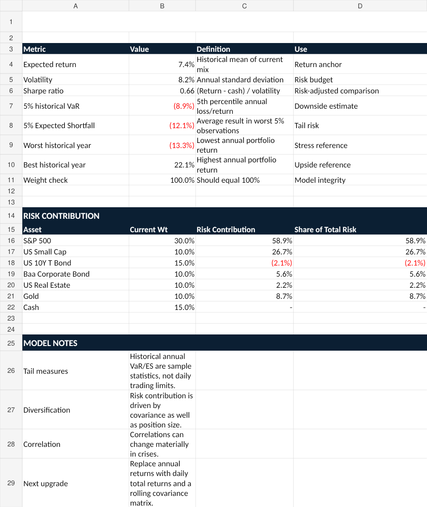
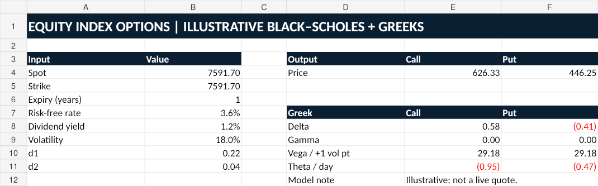
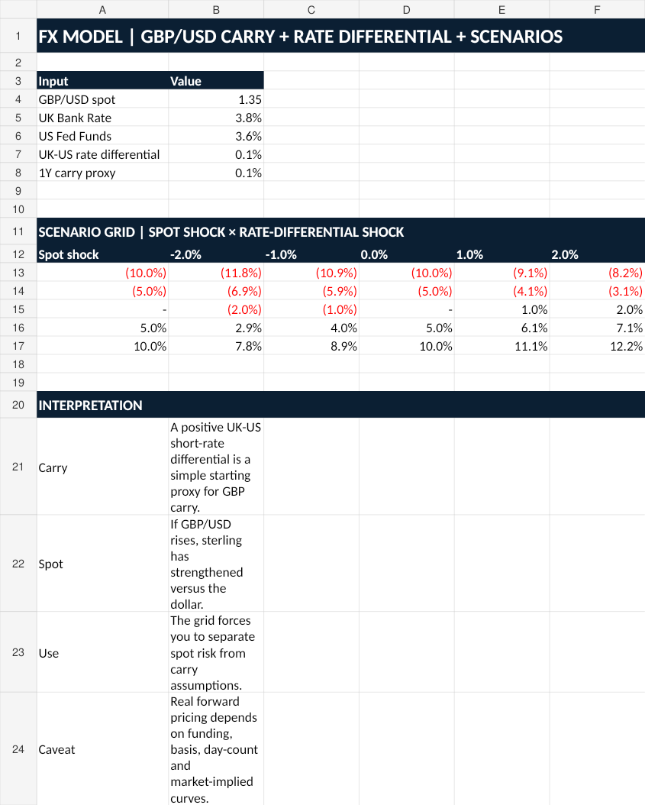

# Global Macro Trading & Risk Engine

**Independent Financial Markets Research Project — Oliver Fletcher**

> A multi-asset research project exploring how macroeconomic data and market signals can be translated into systematic investment decisions across equities, rates, FX, commodities, credit and real estate.

[](https://www.python.org/)
[](https://www.microsoft.com/microsoft-365/excel)
[](https://www.goldmansachs.com/)

## Project at a glance

I wanted to move beyond simply following markets and investigate a broader question:

> **Can macroeconomic information and market signals be translated into a repeatable framework for adjusting portfolio risk across different market environments?**

The project combines a **macro regime engine, multi-asset portfolio construction, historical back-testing, optimisation, benchmark diagnostics, risk modelling and derivatives/fixed-income/FX analysis**.

The core historical data covers **1998–2025**, with the main strategy back-test running from **2000–2025**.

## Key historical results

| Metric | Regime Strategy | S&P 500 |
|---|---:|---:|
| Cumulative return | **448.0%** | 638.8% |
| CAGR | **6.8%** | 8.0% |
| Volatility | **6.9%** | 17.8% |
| Maximum drawdown | **-11.0%** | -36.5% |
| Sharpe ratio | **0.73x** | 0.43x |

### The key finding

The strategy did **not** beat the S&P 500 over the full sample. Instead, its objective was to test whether a rules-based regime approach could reduce risk and drawdown.

The result was a clear trade-off: the strategy had materially lower historical volatility and drawdown, but also captured less upside during strong equity markets.

That trade-off is one of the most important lessons from the project.

## Dashboard



## Back-test



## Portfolio optimisation



## Risk analytics



## Options model



## FX model



---

# Research architecture

```text
Macroeconomic Data
        │
        ▼
   Market Signals
        │
        ▼
   Regime Engine
        │
        ▼
 Portfolio Weights
        │
        ├───────────────┐
        ▼               ▼
    Back-test        Risk Engine
        │               │
        ├───────┬───────┤
        ▼       ▼       ▼
   Attribution Stress  Monte Carlo
        │       │       │
        └───────┴───────┘
                ▼
        Investment Conclusion
```

## Model stack

### 1. Macro regime engine
Uses:
- Monetary-policy direction
- Brent/energy-price movement
- Equity-market momentum
- Credit relative performance

These signals are combined into four regimes:

**Risk-on → Growth → Balanced → Defensive**

### 2. Multi-asset portfolio
The framework can allocate across:
- S&P 500
- US Small Cap
- US 10Y Treasury
- Baa Corporate Bonds
- US Real Estate
- Gold
- Brent
- Cash

### 3. Portfolio construction
Compared:
- Equal weight
- Risk parity
- Minimum variance
- Maximum Sharpe
- Efficient-frontier portfolios

### 4. Performance diagnostics
Calculated:
- CAGR
- Volatility
- Sharpe ratio
- Maximum drawdown
- Beta
- Correlation
- Tracking error
- Information ratio
- Upside capture
- Downside capture

The strategy's historical benchmark diagnostics show approximately **0.30 beta**, **56% upside capture** and **11% downside capture** versus the S&P 500.

### 5. Risk
Includes:
- Historical VaR
- Expected Shortfall
- Risk contribution
- Stress tests
- Monte Carlo simulation

### 6. Fixed income
Includes:
- Modified duration
- DV01
- Convexity
- Yield-shock P&L

### 7. Options
Includes an illustrative Black-Scholes framework and:
- Delta
- Gamma
- Vega
- Theta

### 8. FX
Includes:
- GBP/USD
- UK-US rate differential
- Carry proxy
- Spot/rate shock scenarios

### 9. Credit
Uses Baa corporate bonds as a simplified credit-cycle proxy.

### 10. Research discipline
The project also includes:
- A hypothetical trade book
- A 30-day market journal
- Model-audit checks
- A limitations/roadmap section

---

# Key lesson

The project is **not** presented as a machine that predicts markets.

The strongest conclusion is:

> **I built a framework for making investment decisions under uncertainty, then tested it honestly enough to identify where it worked and where it failed.**

One of the most useful findings was the trade-off between downside protection and upside capture: defensive positioning reduced losses in difficult periods, but it also meant missing part of subsequent recoveries.

---

# How to run the Python examples

```bash
pip install -r requirements.txt
python python/regime_model.py
python python/backtest.py
python python/options_black_scholes.py
python python/fixed_income.py
python python/monte_carlo.py
```

The Excel workbook contains the complete integrated model and presentation layer; the Python directory contains deliberately readable examples of the core calculations.

## Data

The included historical dataset is the same dataset used by the project workbook. Source URLs are retained in the CSV and workbook.

The project uses historical return series and macro proxies as an educational research dataset. It is **not a live trading system** and is not investment advice.

## Limitations

The current framework is deliberately transparent rather than production-grade. Areas for future development include:
- Higher-frequency observations
- Consensus-vs-actual macroeconomic surprises
- Rolling out-of-sample optimisation
- Volatility targeting
- More realistic execution and transaction-cost modelling
- Term-structure and spread data
- Option-implied volatility surfaces
- Full factor decomposition
- More detailed credit-spread and default modelling

## Repository structure

```text
├── README.md
├── data/
│   ├── historical_returns.csv
│   └── regime_engine_output.csv
├── figures/
├── model/
│   └── Global_Macro_Trading_Risk_Engine_V4.xlsx
├── python/
│   ├── backtest.py
│   ├── fixed_income.py
│   ├── monte_carlo.py
│   ├── options_black_scholes.py
│   ├── portfolio_optimisation.py
│   ├── regime_model.py
│   └── risk_metrics.py
└── report/
    ├── Global_Macro_Trading_Risk_Engine_Report.pdf
    └── Goldman_FICC_Equities_Project_Full_Guide.pdf
```

## Author

**Oliver Fletcher**

Independent research project completed to deepen understanding of global financial markets, portfolio construction and risk management.
